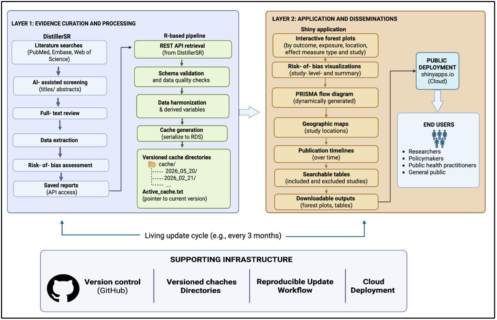

# A reproducible framework for living synthesis of observational evidence

This repository contains the code and processed data for a framework that keeps a living systematic review up to date and publishes it as an interactive web application. It was built for evidence that cannot reasonably be pooled: observational studies that differ in design, exposure definitions, outcomes and effect measures. Rather than producing summary estimates, the application shows each study-level estimate alongside its risk-of-bias assessment and lets users filter the evidence themselves.

The framework is demonstrated through a living systematic review of residential exposure to animal feeding operations (AFOs) and human health.

-   **Live application:** <https://livestock-lsr.shinyapps.io/LivingSR/>
-   **Review protocol:** <https://syreaf.org/wp-content/uploads/2022/05/Draft_Protocol_CAFO-3.pdf>

## How the framework works

The framework separates the work of maintaining the review from the work of presenting it.

1.  **Evidence curation and processing.** Searching, screening, data extraction and risk-of-bias assessment take place in DistillerSR. An R script then retrieves the curated data through the DistillerSR REST API, checks it against fixed templates, harmonizes it across study designs, and saves it as dated `.rds` cache files.
2.  **Evidence dissemination and visualization.** An R/Shiny application reads only the cache files. It never connects to DistillerSR, so the public application keeps working while an update is being prepared, and its code does not change between updates.

<!-- Add Figure 1 from the manuscript as docs/Figure1.png -->



## The illustrative review

The review examines associations between residential exposure to AFOs and quantitatively measured health outcomes in observational studies. Exposure is characterized by measures such as residential proximity and modelled emissions.

-   **Study designs:** cross-sectional, cohort and case-control. Each design has its own extraction form and dataset.
-   **Outcome domains in the application:** lower respiratory, upper respiratory, gastrointestinal, infectious conditions and antimicrobial resistance.
-   **Effect measures:** for each exposure–outcome pair, the reported estimate is classified as a contrast of comparative incidence or of comparative prevalence. The two kinds are displayed in separate forest plots and are never combined.
-   **Risk of bias:** assessed with the CLARITY Group tool for estimates of comparative incidence. Domain-level judgments for confounding, participant selection, exposure classification, outcome measurement and selective reporting appear in a pop-up linked to each estimate.

The application has been publicly available since 2021. The automated update pipeline in this repository, which retrieves data through the DistillerSR API, was introduced in 2026.

## Repository structure

```         
.
├── ui.r, server.r, global.r     Shiny application
├── cache_functions.R            DistillerSR API access and report parsing
├── update_cache.R               Runs a complete evidence update
├── datasets/                    Excel templates defining the expected columns
│   ├── distiller_cross.xlsx
│   ├── distiller_casecontrol.xlsx
│   └── distiller_cohort.xlsx
├── cache/                       Versioned evidence snapshots
│   ├── YYYY_MM_DD/              One folder per update
│   └── active_cache.txt         Names the folder the application loads
├── www/                         Stylesheet and images
├── renv.lock                    Exact package versions
└── LICENSE
```

Each update folder contains the following files:

| File                      | Contents                                                    |
|---------------------------|-------------------------------------------------------------|
| `included_cache_1.rds`    | Included studies with full bibliographic and study metadata |
| `included_cache_2.rds`    | Reduced study table used by the interface                   |
| `cross_base_cache.rds`    | Extracted data from cross-sectional studies                 |
| `forest_case_cache.rds`   | Extracted data from case-control studies                    |
| `forest_cohort_cache.rds` | Extracted data from cohort studies                          |
| `excluded_cache.rds`      | Excluded studies with reasons for exclusion                 |
| `refs_cache.rds`          | Reference records used for the PRISMA flow diagram          |

## Running the application locally

No DistillerSR account is needed. The application runs entirely from the cache files in this repository.

``` r
# install.packages("renv")
renv::restore()     # installs the package versions recorded in renv.lock
shiny::runApp()
```

## Updating the evidence base

This section is for review maintainers. An update requires a DistillerSR account with API access to the review project.

**In DistillerSR**, every three months:

1.  Rerun the saved PubMed search and let DistillerSR remove duplicates.
2.  Screen titles and abstracts. One human reviewer and an AI reviewer, trained on earlier screening decisions, assess each record; disagreements are resolved by a human reviewer.
3.  Screen full texts. Two human reviewers assess each article.
4.  Extract data and assess risk of bias for the newly included studies.

**In R:**

``` r
install.packages("getPass")   # once
source("update_cache.R")
```

The script asks for your DistillerSR username and password. They are used only for that session and are not saved in the code, the cache files or this repository.

For each saved report, the script:

1.  downloads the report through the DistillerSR API;
2.  compares its columns with the matching template in `datasets/`, adding missing columns as empty, reporting unexpected ones, and enforcing the template's column order and data types;
3.  harmonizes variable names and derives the variables the application needs;
4.  writes the results to a new dated folder in `cache/`.

Earlier folders are kept, so the evidence base at each previous update remains available.

**Before release:**

1.  Point `active_cache.txt` to the new folder and run the application locally to check every tab.
2.  Commit and push the new folder.
3.  Redeploy the application to shinyapps.io.

## Adapting the framework to another review

The update pipeline and the caching mechanism are not specific to AFOs. To use them for another review:

1.  Set `project_id` and the saved report IDs in `cache_functions.R` to those of your DistillerSR project.
2.  Replace the templates in `datasets/` with templates matching your own extraction forms.
3.  Adjust the `extract_*` functions in `cache_functions.R` if your forms are structured differently.
4.  Replace the outcome domains defined in `global.r`, and the corresponding tabs in `ui.r` and `server.r`, with those of your review.

The interface is organized around the outcome domains of this review, so step 4 involves the most work.

## Requirements

-   R [version]
-   Main packages: shiny, shinydashboard, shinyWidgets, ggplot2, ggiraph, plotly, DT, leaflet, timevis, DiagrammeR, httr, jsonlite, dplyr, readxl, getPass

The exact versions of all packages are recorded in `renv.lock`.

## Data

The cache files contain study-level information extracted from published articles: study characteristics, effect estimates with confidence intervals, and risk-of-bias judgments. They contain no individual participant data.

## How to cite

If you use this framework or its data, please cite both the article and the archived software:

> Fonseca-Martinez BA, et al. [Title]. [Journal]; [year]. [DOI]

## Contact

B. Alex Fonseca-Martinez — [bafonseca258\@gmail.com](mailto:bafonseca258@gmail.com){.email}
